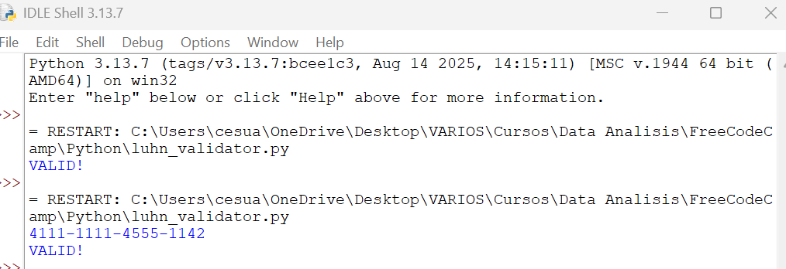
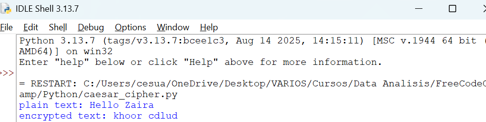

# Python Projects: Luhn Card Validator & Caesar Cipher
**Última actualización: 14 de septiembre de 2025, 12:30 PM -05:00**

Bienvenido a mi repositorio personal de proyectos en Python. Aquí presento dos implementaciones prácticas que demuestran mis habilidades en programación, manipulación de datos y criptografía básica. Estos proyectos fueron desarrollados como parte de mi aprendizaje continuo y están listos para ser explorados o mejorados. ¡Feedback y colaboraciones son bienvenidas!

## Proyectos

### 1. Validador Sofisticado de Números de Tarjeta con Algoritmo Luhn - Evaluación Invertida de Dígitos
- **Descripción**: Este proyecto implementa el Algoritmo de Luhn, una técnica para validar números de tarjetas de crédito. Procesa dígitos al revés, suma impares y dobla pares (ajustando si >9), verificando si la suma es múltiplo de 10.
- **Archivo**: [luhn_validator.py](luhn_validator.py)
- **Ejemplo**: Para '4111-1111-4555-1142', salida: `VALID!`
- **Habilidades**: Slicing, bucles, condicionales, módulo.
- - **Captura de pantalla**:
   

### 2. Cifrador Clásico de César - Transformación Invertida de Texto con Desplazamiento
- **Descripción**: Un cifrador que desplaza letras en el alfabeto (e.g., shift=3), manteniendo espacios, usando módulo para ciclos.
- **Archivo**: [caesar_cipher.py](caesar_cipher.py)
- **Ejemplo**: 'Hello Zaira' → `encrypted text: khoor cdilrd`
- **Habilidades**: Bucles, condicionales, operaciones modulares.
- - **Captura de pantalla**:
  

## Instrucciones de Uso
1. Clona el repo: `git clone https://github.com/boleano8/Python-Projects-Luhn-Caesar`
2. Navega: `cd Python-Projects-Luhn-Caesar`
3. Ejecuta: `python luhn_validator.py` o `python caesar_cipher.py`
4. Requisitos: Python 3.x

## Tecnologías
- **Lenguaje**: Python 3.x
- **Editor**: Notepad++ (o tu IDE)

## Licencia
[MIT License](LICENSE) - Uso y modificación libre.

## Contribuciones
- Abre un "Issue" para sugerencias.
- Conecta en [LinkedIn](https://www.linkedin.com/in/rickandmorty8/).

## Notas
Proyectos creados el 14/09/2025. ¡Gracias por visitar! 🌟
#Python #AlgoritmoLuhn #CifradoCésar #Programación
